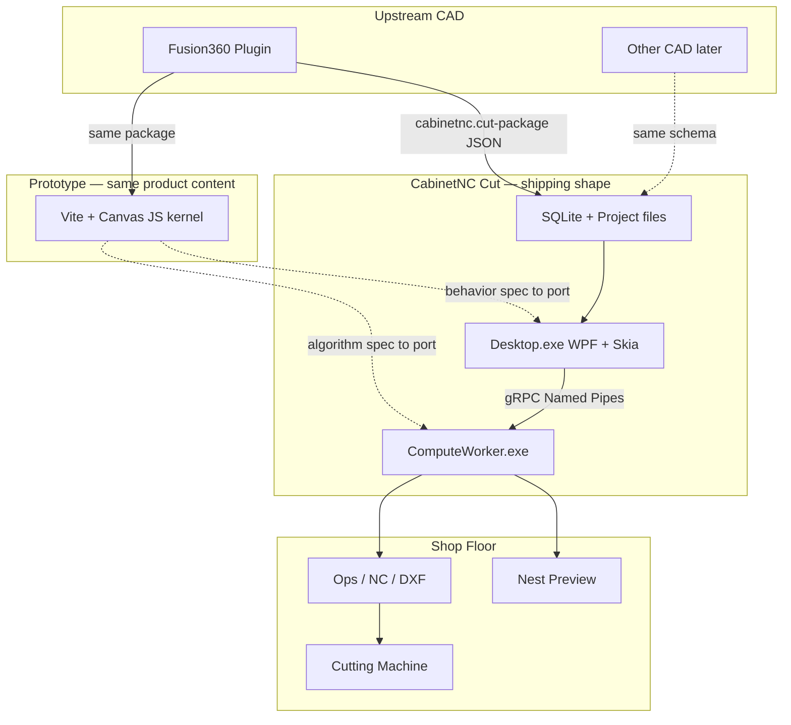
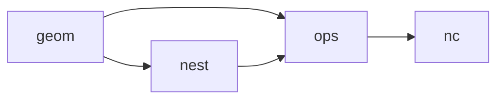

# CabinetNC Cut — Target Architecture

**Merged decision (2026-07-21):** PDF 定**底层实现架构**；当前 Vite 仓库定**产品内容与行为规格**。  
细节对照见 [docs/STACK_MERGE.md](./docs/STACK_MERGE.md)。参考 PDF：`木工制造软件独立客户端架构方案.pdf`。

## Split of authority

| Authority | Source | Examples |
|-----------|--------|----------|
| **How it runs** | PDF | .NET 10 · WPF · SkiaSharp · Desktop + ComputeWorker · gRPC Named Pipes · Clipper2 C# · SQLite · signed MSI/EXE |
| **What it does** | `cabinetnc-cut` today | MakerHub-depth stages · geom/nest/ops/nc · libraries · preflight · job sheet · `cabinetnc.cut-package` |

Vite app = **living product prototype / acceptance oracle**. .NET Solution = **shipping runtime**. Port behavior; do not reinvent product scope.

## Context map



## Layer responsibilities

| Layer | Owns | Does not own |
|-------|------|----------------|
| **Fusion plugin** | Export `cabinetnc.cut-package` v1; Pack Only optional | Nest UI, machine NC dialects, long-term editing |
| **Desktop.exe** | WPF chrome, project UI, Skia canvases, worker lifecycle, config | Long Nest / Toolpath (must call Worker) |
| **ComputeWorker.exe** | Geom validate, Clipper2, nest, ops, toolpath, post/NC | Widgets, Fusion API |
| **On-disk contract** | `cabinetnc.cut-package` / `.cut.json` (+ later Manufacturing Package mapping) | MakerHub proprietary binaries |
| **Vite prototype** | Prove product slices; `npm run check` for content | Final shop installer |

## Kernel API boundary (language-agnostic; JS today → C# Worker)

```text
PanelGeom
  outline + holes + features (holeVertical / grooveVertical / …)
    → nest(panels, sheetParams) → NestResult
    → ops(panels, nestResult) → CutOps
    → nc(ops, machineProfile) → NC text / DXF
```



**Rule:** UI may call Worker; UI must not embed nest/offset/NC algorithms inline.

## Stack (locked)

| | Vite prototype (now) | Shipping target (PDF) |
|--|---------------------|------------------------|
| Shell | Browser + Canvas | **WPF** + CommunityToolkit.Mvvm |
| Canvas | HTML Canvas | **SkiaSharp** (display ≠ production geom) |
| Kernel | `src/geom|pack|ops|nc` JS | **ComputeWorker** C# (same pipeline) |
| Offset/boolean | Clipper2 C++ CLI via Vite API | **Clipper2 C#** in Worker |
| IPC | HTTP `/api/offset` (dev only) | **gRPC + Named Pipes** |
| Store | localStorage + download | **SQLite** + project folder |
| Deliverable | `npm run portable` (Node) | **Signed MSI/EXE** |
| Fusion | exporter only | exporter only |

Not for v1 shipping stack: Electron · Tauri · Docker/K8s · cloud-required path.

## Prototype assets to port (not throw away)

| Status | Asset |
|--------|--------|
| **in — content spec** | Stages shell, inspector density, materials/tools library, nest engines, CAM sim, NC dialects, preflight, job sheet, import (DXF/SVG/merge) |
| **in — transition** | `native/cabinetnc_core` Clipper CLI (oracle / fallback until C# Clipper parity) |
| **retire as deliverable** | Node `start.bat` portable as *the* shop installer (keep only as interim) |

## Dual-window ownership (prototype era)

See [OWNERS.md](./OWNERS.md). While Vite remains the content lab:

| Window | Owns |
|--------|------|
| **A · Geom** | `geom` + Geom canvas behavior |
| **B · Nest/CAM** | `pack` / `ops` / `nc` behavior |
| **Shared contract** | `cabinetnc.cut-package` v1 — change only with both sides ACK |

.NET Desktop/Worker work follows PDF project layout (`Woodwork.*` or `CabinetNC.*` naming TBD) and ports the above behavior.

## Product direction

**深度对标 MakerHub 切割站**（交互 / 工作流 / 功能密度）。见 [docs/VISION.md](./docs/VISION.md)、[docs/MAKERHUB_SHELL.md](./docs/MAKERHUB_SHELL.md)。  
底层不抄 MakerHub（他们是 .NET FX + WebView2 + 进程内 DLL）；我们按 PDF：WPF + Worker。

## Explicit constraints

- 发行包不捆绑第三方专有二进制作运行时依赖（含 MakerHub/DXOPT）  
- Schema 变更走 ACK；Desktop 与 Worker 经版本化 IPC Contract  
- 算法进 Worker / Domain，不进 WPF 内联  
- 显示几何（Skia）与生产几何（Domain + Clipper）分离  

## Milestone sketch

1. **Foundation (done in Vite)** — 壳 + geom/nest/NC 产品内容  
2. **Desktop P0** — .NET Solution · Package import · Skia viewer · Worker Ping  
3. **Port Nest/CAM/NC** — JS 行为迁入 Worker；Validator 对齐 `nest_verify`  
4. **M5–M6 shipping** — 单机后置闭环 + signed installer（替代 portable）  

---

*Fusion is the CAD faucet. The product content lives in this repo. The PDF stack is how it ships on Windows.*
